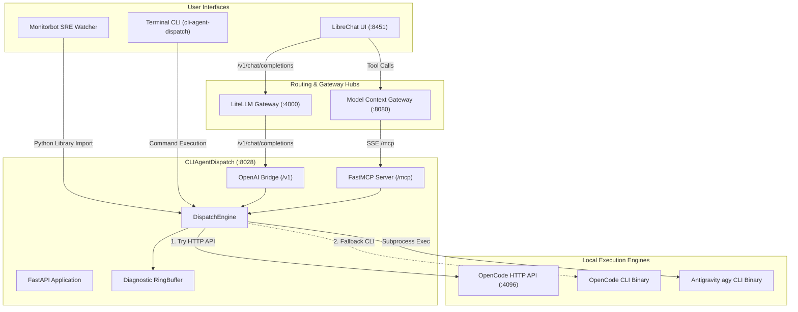
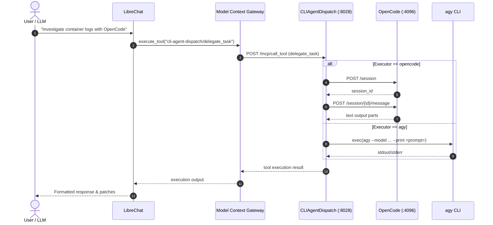
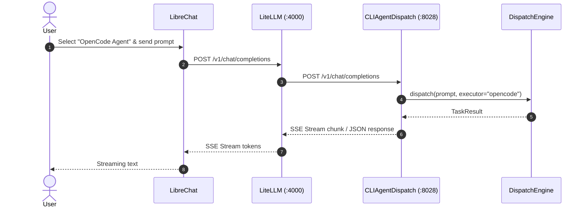

# ARCHITECTURE.md: CLIAgentDispatch

## 🏛️ System Topology

```mermaid
flowchart TD
    subgraph UI ["User Interfaces"]
        LC["LibreChat UI (:8451)"]
        CLI["Terminal CLI (cli-agent-dispatch)"]
        MB["Monitorbot SRE Watcher"]
    end

    subgraph Hubs ["Routing & Gateway Hubs"]
        LITE["LiteLLM Gateway (:4000)"]
        MCG["Model Context Gateway (:8080)"]
    end

    subgraph Service ["CLIAgentDispatch (:8028)"]
        API["FastAPI Application"]
        MCP["FastMCP Server (/mcp)"]
        OAI["OpenAI Bridge (/v1)"]
        ENG["DispatchEngine"]
        TAP["Diagnostic RingBuffer"]
    end

    subgraph Engines ["Local Execution Engines"]
        OC_SRV["OpenCode HTTP API (:4096)"]
        OC_CLI["OpenCode CLI Binary"]
        AGY_CLI["Antigravity agy CLI Binary"]
    end

    LC -->|/v1/chat/completions| LITE
    LC -->|Tool Calls| MCG
    LITE -->|/v1/chat/completions| OAI
    MCG -->|SSE /mcp| MCP
    MB -->|Python Library Import| ENG
    CLI -->|Command Execution| ENG

    OAI --> ENG
    MCP --> ENG
    ENG --> TAP

    ENG -->|1. Try HTTP API| OC_SRV
    ENG -.->|2. Fallback CLI| OC_CLI
    ENG -->|Subprocess Exec| AGY_CLI
```

---

## 🔄 Sequence: FastMCP Tool Delegation

```mermaid
sequenceDiagram
    autonumber
    actor User as User / LLM
    participant LC as LibreChat
    participant MCG as Model Context Gateway
    participant CAD as CLIAgentDispatch (:8028)
    participant OC as OpenCode (:4096)
    participant AGY as agy CLI

    User->>LC: "Investigate container logs with OpenCode"
    LC->>MCG: execute_tool("cli-agent-dispatch/delegate_task")
    MCG->>CAD: POST /mcp/call_tool (delegate_task)
    alt Executor == opencode
        CAD->>OC: POST /session
        OC-->>CAD: session_id
        CAD->>OC: POST /session/{id}/message
        OC-->>CAD: text output parts
    else Executor == agy
        CAD->>AGY: exec(agy --model ... --print <prompt>)
        AGY-->>CAD: stdout/stderr
    end
    CAD-->>MCG: tool execution result
    MCG-->>LC: execution output
    LC-->>User: Formatted response & patches
```

---

## 🔄 Sequence: OpenAI Chat Completion Bridge

```mermaid
sequenceDiagram
    autonumber
    actor User as User
    participant LC as LibreChat
    participant LITE as LiteLLM (:4000)
    participant CAD as CLIAgentDispatch (:8028)
    participant ENG as DispatchEngine

    User->>LC: Select "OpenCode Agent" & send prompt
    LC->>LITE: POST /v1/chat/completions
    LITE->>CAD: POST /v1/chat/completions
    CAD->>ENG: dispatch(prompt, executor="opencode")
    ENG-->>CAD: TaskResult
    CAD-->>LITE: SSE Stream chunk / JSON response
    LITE-->>LC: SSE Stream tokens
    LC-->>User: Streaming text
```
