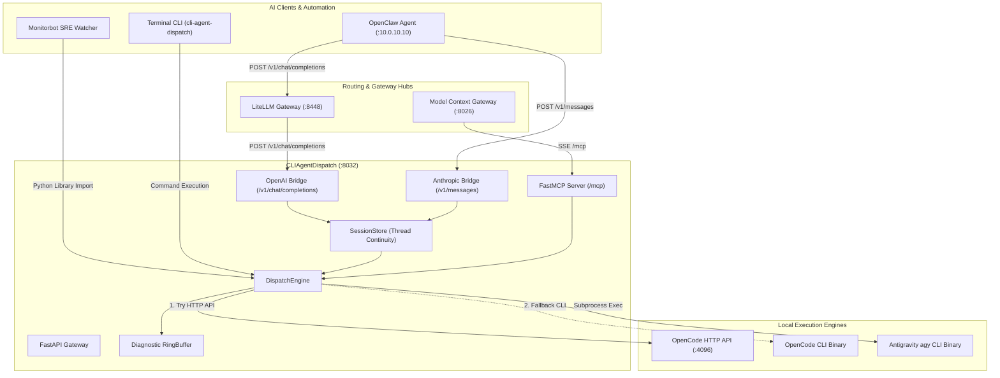
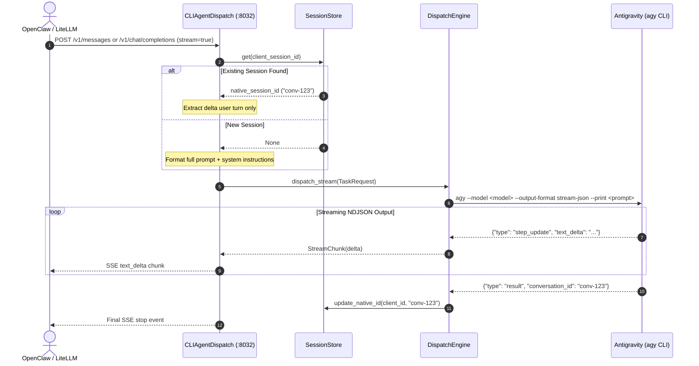
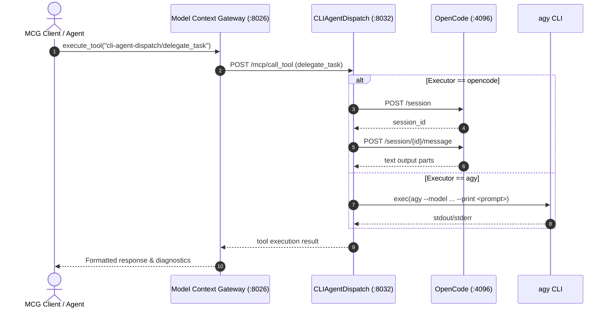

# ARCHITECTURE.md: CLIAgentDispatch

## 🏛️ System Topology

```mermaid
flowchart TD
    subgraph Clients ["AI Clients & Automation"]
        OCL["OpenClaw Agent (:10.0.10.10)"]
        CLI["Terminal CLI (cli-agent-dispatch)"]
        MB["Monitorbot SRE Watcher"]
    end

    subgraph Hubs ["Routing & Gateway Hubs"]
        LITE["LiteLLM Gateway (:8448)"]
        MCG["Model Context Gateway (:8026)"]
    end

    subgraph Service ["CLIAgentDispatch (:8032)"]
        API["FastAPI Gateway"]
        STORE["SessionStore (Thread Continuity)"]
        OAI["OpenAI Bridge (/v1/chat/completions)"]
        ANTH["Anthropic Bridge (/v1/messages)"]
        MCP["FastMCP Server (/mcp)"]
        ENG["DispatchEngine"]
        TAP["Diagnostic RingBuffer"]
    end

    subgraph Engines ["Local Execution Engines"]
        OC_SRV["OpenCode HTTP API (:4096)"]
        OC_CLI["OpenCode CLI Binary"]
        AGY_CLI["Antigravity agy CLI Binary"]
    end

    OCL -->|POST /v1/messages| ANTH
    OCL -->|POST /v1/chat/completions| LITE
    LITE -->|POST /v1/chat/completions| OAI
    MCG -->|SSE /mcp| MCP
    MB -->|Python Library Import| ENG
    CLI -->|Command Execution| ENG

    OAI --> STORE
    ANTH --> STORE
    STORE --> ENG
    MCP --> ENG
    ENG --> TAP

    ENG -->|1. Try HTTP API| OC_SRV
    ENG -.->|2. Fallback CLI| OC_CLI
    ENG -->|Subprocess Exec| AGY_CLI
```

---

## 🔄 Sequence: Anthropic & OpenAI Streaming Delegation

```mermaid
sequenceDiagram
    autonumber
    actor Client as OpenClaw / LiteLLM
    participant Gateway as CLIAgentDispatch (:8032)
    participant Store as SessionStore
    participant Engine as DispatchEngine
    participant Agy as Antigravity (agy CLI)

    Client->>Gateway: POST /v1/messages or /v1/chat/completions (stream=true)
    Gateway->>Store: get(client_session_id)
    alt Existing Session Found
        Store-->>Gateway: native_session_id ("conv-123")
        Note over Gateway: Extract delta user turn only
    else New Session
        Store-->>Gateway: None
        Note over Gateway: Format full prompt + system instructions
    end
    Gateway->>Engine: dispatch_stream(TaskRequest)
    Engine->>Agy: agy --model <model> --output-format stream-json --print <prompt>
    loop Streaming NDJSON Output
        Agy-->>Engine: {"type": "step_update", "text_delta": "..."}
        Engine-->>Gateway: StreamChunk(delta)
        Gateway-->>Client: SSE text_delta chunk
    end
    Agy-->>Engine: {"type": "result", "conversation_id": "conv-123"}
    Engine->>Store: update_native_id(client_id, "conv-123")
    Gateway-->>Client: Final SSE stop event
```

---

## 🔄 Sequence: FastMCP Tool Delegation

```mermaid
sequenceDiagram
    autonumber
    actor Caller as MCG Client / Agent
    participant MCG as Model Context Gateway (:8026)
    participant CAD as CLIAgentDispatch (:8032)
    participant OC as OpenCode (:4096)
    participant AGY as agy CLI

    Caller->>MCG: execute_tool("cli-agent-dispatch/delegate_task")
    MCG->>CAD: POST /mcp/call_tool (delegate_task)
    alt Executor == opencode
        CAD->>OC: POST /session
        OC-->>CAD: session_id
        CAD->>OC: POST /session/{id}/message
        OC-->>CAD: text output parts
    else Executor == agy
        CAD->>AGY: exec(agy --model ... --print <prompt>)
        AGY-->>CAD: stdout/stderr
    end
    CAD-->>MCG: tool execution result
    MCG-->>Caller: Formatted response & diagnostics
```
